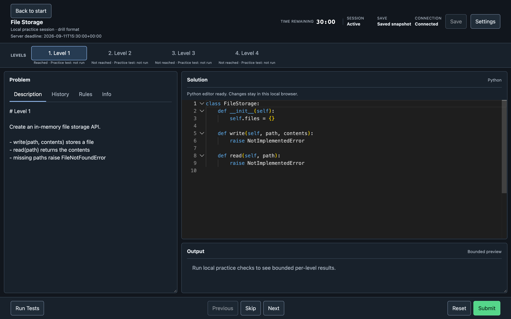

# CodeSignal Practice Simulator

Practice a four-level, timed CodeSignal-style assessment on your machine.
The browser IDE and the CLI drive the same attempt: one timer, one score.



## Quick start

Python 3.10+, from this directory (tested with Just 1.58):

```sh
just setup                 # Install the editable Python app
just fetch                 # Download the pinned assessment
just dev                   # Open the local browser IDE
```

`just dev` serves the bundled UI from a Python loopback server. It does not
start the timer. In the UI, choose **Start practice**, then **Confirm and start**.
There is no pause. Stop the server with Ctrl-C. Keep the printed URL private.

Just recipes are optional shortcuts. Without `just`:

```sh
python3 -m venv .venv
. .venv/bin/activate
python -m pip install --no-deps -e .
codesignal-sim fetch --workspace-root "$PWD"
codesignal-sim web --workspace-root "$PWD" --port 0
python3 -m codesignal_practice_simulator --help
```

The app has no Python runtime dependencies, and you do not need Node to run
it.

## How this was built

The browser app was built through **Festival Methodology**, in festival
**CB0001 — codesignal-browser-assessment-simulator**, completed September 10,
2026. The work extended the existing Python CLI and scoring engine rather than
creating a separate browser-only simulator.

The festival organized the build into six phases: requirements intake,
architecture and planning, the shared application backend, the assessment IDE,
browser verification, and release review. Work moved through the `fest next`
loop, with task completion, testing, review, and traceable commits. Cursor
agents handled implementation and independent architecture, security, and UI
reviews; review findings fed back into fixes before release.

The result pairs a Python loopback server with a locally bundled TypeScript UI
and Monaco editor. The browser and CLI share one server-authoritative attempt
lifecycle. Verification covered unit and HTTP tests, real Playwright browser
journeys, offline operation, and installed Python packages.


That clip is the six-phase festival that built the browser app, not a practice
run.

## Practice

`fetch` is required before you can start. The assessment is FETCH_ONLY: this
repo does not ship it, and there is no license to redistribute its README,
prompts, starter, or bundled test. Fetch writes seven pinned files into the
ignored cache `.cache/codesignal-fixtures/6aab304/`. Do not commit that cache.
The installed package contains only first-party pinned paths and hashes, but never fixture bytes.
A wheel does not include pinned fixtures; offline, pass `--source` a complete
approved tree.

```sh
codesignal-sim fetch --workspace-root "$PWD"
codesignal-sim start --workspace-root "$PWD" --mode drill
codesignal-sim web --workspace-root "$PWD" --port 0 --no-open
```

`start` defaults to `full-90m` (90 minutes). `--mode drill` uses `drill-30m`
(30 minutes unless you pass `--drill-duration-seconds`). See
[drill profiles](docs/drill-profiles.md).

Open the complete printed `127.0.0.1` URL, including the `#...` fragment. That
fragment is a private per-launch capability. Do not paste the URL into chat,
tickets, screenshots, or logs.

The browser UI and direct CLI are two transports for the same attempt. The
server-authoritative timer, scoring, and lifecycle own the result. At the
deadline, the browser becomes read-only and **Submit** is disabled.
The CLI remains the explicit fallback:

```sh
codesignal-sim submit --workspace-root "$workspace"
```

Full command contract, exits, and recovery:
[docs/cli-contract.md](docs/cli-contract.md).
During a timed attempt, follow [AGENTS.md](AGENTS.md) and
[docs/agent-safety.md](docs/agent-safety.md).

```text
workspace/
├── .cache/codesignal-fixtures/6aab304/  # ignored FETCH_ONLY cache
└── attempts/
    ├── active.json                      # selected UUID
    └── <uuid>/
        ├── session.json                 # authoritative lifecycle state
        ├── events.jsonl
        ├── STATUS.md                    # generated view
        └── COACHING.md                  # your notes
```

`attempts/<uuid>/session.json` is the session record. Do not hand-edit it.

## Install

```sh
python3 -m venv .venv
. .venv/bin/activate
python -m pip install --no-deps -e .
codesignal-sim --help
python3 -m codesignal_practice_simulator --help
```

For a previously built wheel:

```sh
python3 -m venv .venv
. .venv/bin/activate
python -m pip install --no-index --no-deps /path/to/codesignal_practice_simulator-*.whl
codesignal-sim --help
```

## After you submit

[`study/`](study/), [`solution/`](solution/), and [`notes/`](notes/) are
opt-in learning material. Do not use them during a live attempt.

At Level 4, the fetched visible test treats `ROLLBACK` as log-only, while the
written task requires restoring state. Implement the written specification.
See [notes/level4-rollback-discrepancy.md](notes/level4-rollback-discrepancy.md).

## Troubleshooting

| Symptom | Safe action |
| --- | --- |
| `start` says the fixture cache is unavailable | Re-run `codesignal-sim fetch --workspace-root "$PWD"`. Do not edit cache files. |
| The browser does not open, or the port is busy | `codesignal-sim web --workspace-root "$PWD" --port 0 --no-open`, then open the new URL. |
| The attempt expired in the browser | It is read-only. Finalize once with CLI `submit` if you want a stored result. |
| Editor assets fail to load | Reinstall the package or wheel. Do not point the UI at a CDN. |

## Contributors

```sh
just verify
python3 scripts/run_legacy_checks.py
```

`run_legacy_checks.py` verifies tracked mappings, cache hashes, and the Git
boundary, then runs first-party solution and study checks. It does not run the fetched
upstream compatibility test.

The simulator is a local practice tool, not an official CodeSignal evaluator.
No local result is equivalent to official hidden tests.
