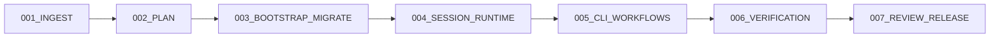

# Festival Structure

## Festival Goal

Deliver a private, campaign-integrated practice simulator that migrates only
user-authored non-verbatim material and uses the unlicensed upstream
`file_storage` material only through validated fetch-only local setup.

## Dependency Rule

`001_INGEST` and `002_PLAN` define the requirements and decisions. The five
delivery/review phases then run in the listed order: migration establishes the
repository and fetch-only cache setup; the runtime creates trustworthy sessions; the
CLI exposes them; verification proves them; and review decides readiness. The
first task of every later sequence declares an explicit hard
`fest_dependencies` edge to the preceding sequence's final gate, including
003.02.01 → 003.01.07; numbering preserves the intentionally sequential work
inside each sequence. No implementation task may create the external remote or
move source until its preflight task has passed.

## Phase and Sequence Breakdown

### 001_INGEST — Source and Requirement Ingest

Workflow phase. Its output specifications establish traceable P0/P1/P2
requirements, constraints, current-source inventory, and campaign integration
context. No implementation sequences exist here.

### 002_PLAN — Architecture and Execution Design

Workflow phase. It produces this hierarchy, the detailed implementation plan,
and decisions D001–D004. No implementation sequences exist here.

### 003_BOOTSTRAP_MIGRATE — Repository and Source Transfer

**Goal:** Safely create the private destination only during execution, move
only non-verbatim user-authored content, retain provenance/hashes for excluded
vendor files, and integrate the result without disturbing unrelated work.

| Sequence | Dependency | Executable tasks |
| --- | --- | --- |
| `01_repository_and_provenance` | Plan complete | Audit source inventory/checksums and upstream terms; create/configure the private Python project and record migration/provenance baseline. |
| `02_content_transfer_and_campaign` | completion of `01_repository_and_provenance` final gate | Copy only safe user-authored manifest mappings; validate all seven excluded vendor cache hashes; commit/push transferred user-authored content to `main` and verify remote SHA before clean-clone evidence and campaign gitlink creation. |

**Source-project anchors:** `README.md` provenance, `.gitignore`,
`requirements.txt`, `assessment/`, `solution/`, `study/`, `notes/`,
`scripts/`, and `justfile`. **Campaign-root integration anchor:**
`CAMPAIGN/.gitmodules`; it is never a source-project anchor or migration
input. `SOURCE/.workitem` is source-local campaign metadata excluded from the
project migration; 003.02.02 records its decided `retained` disposition, and
the JobSearch campaign maintainer owns any later retirement/update.

The schema-version 2 manifest records upstream URL/commit and expected
paths/hashes but no vendor contents. It declares exactly upstream `README.md`
→ `vendor-readme.md` and six `practice_assessments/file_storage/` →
`assessment/file_storage/` records under the ignored cache. Included
user-authored records have normalized unique destinations, including the
explore README at `docs/legacy/explore-README.md`; vendor records are excluded
with null destinations, and only the exact seven fetch records have ignored
cache paths. Verifier scopes separately
validate `tracked` mappings, all `fixture-cache` hashes, and staged/HEAD
Git-boundary hashes and paths.

### 004_SESSION_RUNTIME — Durable Attempt Engine

**Goal:** Implement the trusted local state model that makes attempts isolated,
timed, resumable, partial-credit aware, and safe for candidate-led coaching.

| Sequence | Dependency | Executable tasks |
| --- | --- | --- |
| `01_session_state_and_workspaces` | 003.02 final gate | Define validated models/state transitions, atomic JSON/JSONL persistence and locks; create isolated full/drill workspaces with injected filesystem-failure rollback, an injected UTC clock, and explicit active-attempt selection. |
| `02_assessment_scoring_and_agent_surfaces` | 01 final gate | Generalize fixture lookup and sanitized per-level subprocess scoring; render derived status/context; establish `COACHING.md` and `AGENTS.md` that remain outside evaluation. |

**Source anchors:** `scripts/new_attempt.py:COPIED_FILES`, legacy `attempts/<timestamp>[_<name>]/attempt.json`,
`scripts/scorecard.py:run_level()/timing()`, fixture `test_group_1` through
`test_group_4`, `notes/walkthrough.md`, and
`notes/level4-rollback-discrepancy.md`.

### 005_CLI_WORKFLOWS — Candidate and Agent Commands

**Goal:** Expose the runtime through a stable, documented command interface
with predictable behavior for candidates and terminal agents.

| Sequence | Dependency | Executable tasks |
| --- | --- | --- |
| `01_command_interface_and_live_session` | 004.02 final gate | Package `codesignal-sim`; implement and test `start`, `resume`, `status`, `time`, and `task` with human/JSON outputs, errors, and lifecycle checks. |
| `02_evaluation_submission_and_operator_docs` | 01 final gate | Implement `test`, `submit`, and `context`; codify exit codes/finality/events; migrate/update quick-start, compatibility Just recipes, coaching, and agent documentation. |

**Source anchors:** `justfiles/practice.just` command recipes,
`scripts/scorecard.py:resolve_target()/main()`, `ATTEMPT.md`, and `RESULT.md`
generation.

### 006_VERIFICATION — Automated Confidence and Clean-Clone Evidence

**Goal:** Prove simulator behavior, source fidelity, and campaign integration
with deterministic automated tests and reproducible local/CI commands.

| Sequence | Dependency | Executable tasks |
| --- | --- | --- |
| `01_runtime_and_contract_tests` | 005.02 final gate | Add unit tests for schemas, state/event recovery, locking, fake clocks, scoring, state transitions, and status/context/coaching invariants. |
| `02_cli_end_to_end_and_migration_release_checks` | 01 final gate | Exercise real CLI lifecycles in temporary roots; run setup via temporary local source or mocked downloader; verify a clean clone/submodule workflow without tracked vendor bytes. |

**Source anchors:** `solution/test_simulation.py`, `solution/test_spec.py`,
`solution/test_stages.py`, `study/check.py`, `justfiles/verify.just`, and
the future JSON schema/CLI contract.

### 007_REVIEW_RELEASE — Readiness and Handoff

**Goal:** Review the complete private-project change for correctness,
provenance, privacy, candidate experience, agent safety, test evidence, and
campaign integration before release.

This is a review phase, so its `PHASE_GOAL.md` records explicit review
criteria and result evidence instead of executable implementation sequences.

## Task Specification Standard

Every implementation task must:

1. Name its source anchors and state what is preserved, moved, or newly built.
2. Give ordered implementation steps, including validation/error behavior.
3. Identify what it must never mutate—especially fixture files, other
   attempts, candidate `simulation.py`, and unrelated campaign state.
4. List exact verification commands and expected outcomes.
5. Finish with checkable completion criteria and leave findings in the
   sequence `results/` directory.

Each implementation sequence receives the testing, code-review, review/iterate,
and focused-commit gates. The gates must use actual project commands once the
minimal packaging/tooling decision is implemented; generic commands are
not acceptable.
